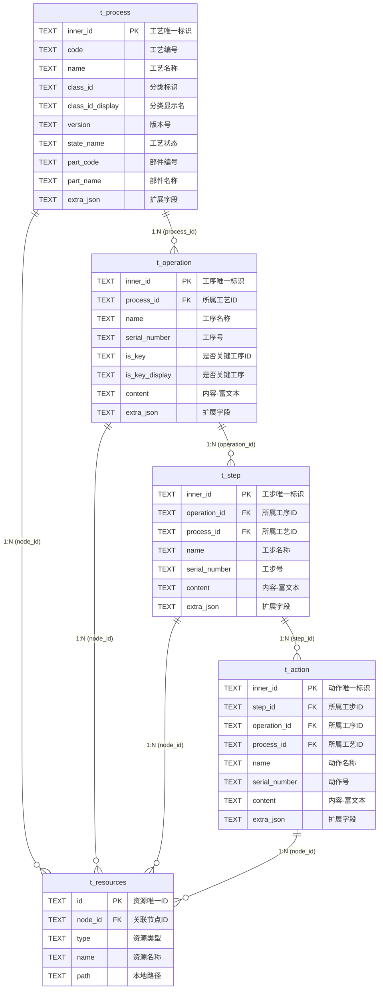

# SRD V6 数据库改造设计文档

> **版本**: V6.0  
> **日期**: 2026-04-21  
> **目标**: 将工艺树从单表 JSON Blob 存储改造为关系型四级独立表存储

---

## 1. 改造背景

### 1.1 当前问题

当前 `t_process` 表通过 `data_json` 字段将整棵工艺树（含所有工序、工步、动作）序列化为单个 JSON Blob 存储：

```sql
-- 当前结构（V5）
CREATE TABLE t_process (
    inner_id TEXT PRIMARY KEY,
    class_id TEXT NOT NULL,
    code     TEXT NOT NULL,
    name     TEXT NOT NULL,
    created_at TEXT,
    updated_at TEXT,
    data_json  TEXT          -- ⚠️ 整棵树 JSON，可达数 MB
);
```

| 问题 | 说明 |
|------|------|
| **查询僵化** | 想展示某工序的字段必须反序列化整棵树再遍历 |
| **扩展困难** | 新增字段需改 ProcessNode 类型定义 |
| **与在线系统脱节** | 在线系统各级有独立表，离线无法对等 |
| **树加载臃肿** | 所有节点的所有字段全部加载到内存 |

### 1.2 改造目标

1. **四级独立成表**：t_process / t_operation / t_step / t_action
2. **导航与详情分离**：树只加载导航字段，详情按需查询
3. **字段可扩展**：核心字段独立列 + `extra_json` 兜底未知字段
4. **与在线系统对齐**：表结构一一映射

---

## 2. 总体架构

### 2.1 数据流概览

```
┌──────────────────────────────────────────────────────────────────┐
│  在线系统                                                         │
│  ┌─────────────┐ ┌─────────────┐ ┌──────────┐ ┌──────────┐      │
│  │ 工艺表       │ │ 工序表       │ │ 工步表    │ │ 动作表    │      │
│  └──────┬──────┘ └──────┬──────┘ └────┬─────┘ └─────┬────┘      │
│         └───────┬───────┴─────────────┴──────────────┘           │
│                 ▼                                                 │
│         导出 SRD V6 数据包                                        │
│         data/process.json                                         │
│         data/operation.json                                       │
│         data/step.json                                            │
│         data/action.json                                          │
│         data/process_tree.json (轻量导航结构)                      │
└──────────────────────┬───────────────────────────────────────────┘
                       │ .srd 文件
                       ▼
┌──────────────────────────────────────────────────────────────────┐
│  离线应用                                                         │
│                                                                    │
│  导入逻辑：                                                       │
│  JSON 字段 → 表中有此列？→ 是：写入独立列                          │
│                          → 否：存入 extra_json                     │
│                                                                    │
│  树渲染：process_tree.json → 仅 innerId/code/name/children         │
│  详情渲染：点击节点 → SELECT * FROM 对应表 WHERE inner_id = ?       │
│           → 独立列直接取 + extra_json 中按 prop 取               │
└──────────────────────────────────────────────────────────────────┘
```

### 2.2 表关系 ER 图



---

## 3. 表结构详细定义

### 3.1 命名规范

| 规范项 | 说明 | 示例 |
|--------|------|------|
| 表名 | `t_` 前缀 + 小写单数 | `t_process`、`t_operation` |
| 列名 | snake_case | `class_id_display`、`serial_number` |
| JSON 字段 | camelCase（与在线系统一致） | `classId_display`、`serialNumber` |
| JSON→列映射 | camelCase → snake_case 自动转换 | `classId` → `class_id` |
| `_display` 字段 | 所有 `xxx_display` 字段都有对应的 `xxx` 字段 | `class_id` + `class_id_display` |

---

### 3.2 t_process — 工艺表

> 根节点表，一个 SRD 包通常对应一条记录。包含工艺自身信息和关联部件信息。

#### DDL

```sql
CREATE TABLE IF NOT EXISTS t_process (
    -- ========== 结构标识字段 ==========
    inner_id                    TEXT PRIMARY KEY,   -- 工艺唯一标识（全局唯一）
    code                        TEXT NOT NULL,       -- 工艺编号，如 ASM-ENG-V8
    name                        TEXT NOT NULL,       -- 工艺名称

    -- ========== 分类信息 ==========
    class_id                    TEXT,                -- 分类标识，如 JJGY
    class_id_display            TEXT,                -- 分类显示名，如 "机加工艺"
    class_id_business_icon      TEXT,                -- 业务图标路径
    class_id_icon               TEXT,                -- 树节点图标路径

    -- ========== 版本与状态 ==========
    version                     TEXT,                -- 工艺版本号，如 3.0.0
    full_version_no             TEXT,                -- 完整版本号，如 A.1
    state_name                  TEXT,                -- 工艺状态，如 "已发布"、"设计中"
    checkout_state              TEXT,                -- 工作状态ID
    checkout_state_display      TEXT,                -- 工作状态，如 "检入"

    -- ========== 修改人信息 ==========
    modify_by_id                TEXT,                -- 最后修改人ID
    modify_by_id_display        TEXT,                -- 最后修改人姓名
    modify_time                 TEXT,                -- 最后修改时间
    create_by_id                TEXT,                -- 创建者ID
    create_by_id_display        TEXT,                -- 创建者姓名
    create_time                 TEXT,                -- 创建时间ID
    create_time_display         TEXT,                -- 创建时间，如 2026-04-21 15:05:30

    -- ========== 组织与知识库 ==========
    context_name                TEXT,                -- 所属知识库名称
    context_id                  TEXT,                -- 上下文ID
    context_id_display          TEXT,                -- 上下文，如 "V8发动机总装工艺知识库"
    department_name             TEXT,                -- 编制单位，如 "智能制造事业部"
    workshop_name               TEXT,                -- 主制车间，如 "智能制造事业部"
    personalworkspace           TEXT,                -- 个人文件夹ID
    personalworkspace_display   TEXT,                -- 个人文件夹，如 "user01"
    folder_path                 TEXT,                -- 文件夹路径，如 "/工艺库"

    -- ========== 阶段与密级 ==========
    phase_id                    TEXT,                -- 工艺阶段ID
    phase_id_display            TEXT,                -- 工艺阶段，如 "试样阶段"
    secret_id                   TEXT,                -- 密级ID
    secret_id_display           TEXT,                -- 密级，如 "公开"
    life_cycle_template         TEXT,                -- 生命周期模板ID
    life_cycle_template_display TEXT,                -- 生命周期模板，如 "标准生命周期模板"

    -- ========== 业务扩展 ==========
    task_name                   TEXT,                -- 工艺任务，如 "V8发动机总装工艺任务"
    route_content               TEXT,                -- 路线内容，如 "V8发动机总装工艺路线"
    mfg_node_name               TEXT,                -- 制造流程，如 "V8发动机总装工艺流程"
    process_characteristics     TEXT,                -- 规程特性
    note                        TEXT,                -- 备注

    -- ========== 关联部件信息（1:1，不独立成表） ==========
    part_code                   TEXT,                -- 部件编号
    part_name                   TEXT,                -- 部件名称
    part_class_id               TEXT,                -- 部件分类标识
    part_class_id_display       TEXT,                -- 部件分类显示名
    part_class_id_business_icon TEXT,                -- 部件业务图标路径
    part_modify_by_id           TEXT,                -- 部件最后修改人ID
    part_modify_by_id_display   TEXT,                -- 部件最后修改人姓名
    part_modify_time            TEXT,                -- 部件最后修改时间
    part_context_name           TEXT,                -- 部件所属库名称
    part_phase_id               TEXT,                -- 部件阶段ID
    part_phase_id_display       TEXT,                -- 部件阶段显示名
    part_secret_id              TEXT,                -- 部件密级ID
    part_secret_id_display      TEXT,                -- 部件密级显示名
    part_state_name             TEXT,                -- 部件状态名称
    part_full_version_no        TEXT,                -- 部件完整版本号

    -- ========== UI 配置引用 ==========
    tabs_top                    TEXT,                -- 上方 Tab 组 ID
    tabs_bottom                 TEXT,                -- 下方 Tab 组 ID

    -- ========== 元数据 ==========
    sort_order                  INTEGER DEFAULT 0,   -- 排序号
    extra_json                  TEXT,                -- 扩展字段（JSON，存放未知/新增字段）
    created_at                  TEXT,                -- 记录创建时间
    updated_at                  TEXT                 -- 记录更新时间
);
```

#### 字段清单（共 55 个列）

| # | 列名 | JSON 字段名 | 类型 | 说明 |
|---|------|------------|------|------|
| 1 | inner_id | innerId | TEXT PK | 工艺唯一标识 |
| 2 | code | code | TEXT | 工艺编号 |
| 3 | name | name | TEXT | 工艺名称 |
| 4 | class_id | classId | TEXT | 分类标识 |
| 5 | class_id_display | classId_display | TEXT | 分类显示名 |
| 6 | class_id_business_icon | classId_business_icon | TEXT | 业务图标路径 |
| 7 | class_id_icon | classId_icon | TEXT | 树节点图标路径 |
| 8 | version | version | TEXT | 版本号 |
| 9 | full_version_no | fullversionNo | TEXT | 完整版本号 |
| 10 | state_name | stateName | TEXT | 工艺状态 |
| 11 | checkout_state | checkoutState | TEXT | 工作状态ID |
| 12 | checkout_state_display | checkoutState_display | TEXT | 工作状态显示 |
| 13 | modify_by_id | modifyById | TEXT | 最后修改人ID |
| 14 | modify_by_id_display | modifyById_display | TEXT | 最后修改人姓名 |
| 15 | modify_time | modifyTime | TEXT | 最后修改时间 |
| 16 | create_by_id | createById | TEXT | 创建者ID |
| 17 | create_by_id_display | createById_display | TEXT | 创建者姓名 |
| 18 | create_time | createTime | TEXT | 创建时间 |
| 19 | create_time_display | createTime_display | TEXT | 创建时间显示 |
| 20 | context_name | contextName | TEXT | 知识库名称 |
| 21 | context_id | contextId | TEXT | 上下文ID |
| 22 | context_id_display | contextId_display | TEXT | 上下文显示 |
| 23 | department_name | departmentName | TEXT | 编制单位 |
| 24 | workshop_name | workshopName | TEXT | 主制车间 |
| 25 | personalworkspace | personalworkspace | TEXT | 个人文件夹ID |
| 26 | personalworkspace_display | personalworkspace_display | TEXT | 个人文件夹显示 |
| 27 | folder_path | folderPath | TEXT | 文件夹路径 |
| 28 | phase_id | phaseId | TEXT | 工艺阶段ID |
| 29 | phase_id_display | phaseId_display | TEXT | 工艺阶段显示 |
| 30 | secret_id | secretId | TEXT | 密级ID |
| 31 | secret_id_display | secretId_display | TEXT | 密级显示 |
| 32 | life_cycle_template | lifeCycleTemplate | TEXT | 生命周期模板ID |
| 33 | life_cycle_template_display | lifeCycleTemplate_display | TEXT | 生命周期模板显示 |
| 34 | task_name | taskName | TEXT | 工艺任务 |
| 35 | route_content | routeContent | TEXT | 路线内容 |
| 36 | mfg_node_name | mfgNodeName | TEXT | 制造流程 |
| 37 | process_characteristics | processCharacteristics | TEXT | 规程特性 |
| 38 | note | note | TEXT | 备注 |
| 39 | part_code | partCode | TEXT | 部件编号 |
| 40 | part_name | partName | TEXT | 部件名称 |
| 41 | part_class_id | partClassId | TEXT | 部件分类标识 |
| 42 | part_class_id_display | partClassId_display | TEXT | 部件分类显示名 |
| 43 | part_class_id_business_icon | partClassId_business_icon | TEXT | 部件业务图标 |
| 44 | part_modify_by_id | partModifyById | TEXT | 部件修改人ID |
| 45 | part_modify_by_id_display | partModifyById_display | TEXT | 部件修改人姓名 |
| 46 | part_modify_time | partModifyTime | TEXT | 部件修改时间 |
| 47 | part_context_name | partContextName | TEXT | 部件所属库 |
| 48 | part_phase_id | partPhaseId | TEXT | 部件阶段ID |
| 49 | part_phase_id_display | partPhaseId_display | TEXT | 部件阶段显示 |
| 50 | part_secret_id | partSecretId | TEXT | 部件密级ID |
| 51 | part_secret_id_display | partSecretId_display | TEXT | 部件密级显示 |
| 52 | part_state_name | partStateName | TEXT | 部件状态 |
| 53 | part_full_version_no | partFullversionNo | TEXT | 部件版本号 |
| 54 | tabs_top | tabs_top | TEXT | 上方 Tab 组 ID |
| 55 | tabs_bottom | tabs_bottom | TEXT | 下方 Tab 组 ID |
| 56 | sort_order | sortOrder | INTEGER | 排序号 |
| 57 | extra_json | — | TEXT | 扩展字段 |
| 58 | created_at | — | TEXT | 记录创建时间 |
| 59 | updated_at | — | TEXT | 记录更新时间 |

---

### 3.3 t_operation — 工序表（新建）

#### DDL

```sql
CREATE TABLE IF NOT EXISTS t_operation (
    -- ========== 结构标识字段 ==========
    inner_id                TEXT PRIMARY KEY,       -- 工序唯一标识
    process_id              TEXT NOT NULL,           -- 所属工艺ID（外键→t_process.inner_id）
    code                    TEXT,                    -- 工序编号（如存在）

    -- ========== 基本信息 ==========
    name                    TEXT NOT NULL,           -- 工序名称
    serial_number           TEXT,                    -- 工序号，如 1、2、3
    class_id                TEXT,                    -- 分类标识
    class_id_display        TEXT,                    -- 分类显示名，如 "机加工序"

    -- ========== 业务字段 ==========
    is_key                  TEXT,                    -- 是否关键工序ID
    is_key_display          TEXT,                    -- 是否关键工序，如 "是"/"否"
    content                 TEXT,                    -- 内容（富文本）

    -- ========== UI 配置引用 ==========
    tabs_top                TEXT,                    -- 上方 Tab 组 ID
    tabs_bottom             TEXT,                    -- 下方 Tab 组 ID

    -- ========== 元数据 ==========
    sort_order              INTEGER DEFAULT 0,       -- 在父级下的排序号
    extra_json              TEXT,                    -- 扩展字段（JSON）
    created_at              TEXT,
    updated_at              TEXT
);

-- 索引
CREATE INDEX IF NOT EXISTS idx_operation_process_id ON t_operation(process_id);
```

#### 字段清单（共 16 个列）

| # | 列名 | JSON 字段名 | 类型 | 说明 |
|---|------|------------|------|------|
| 1 | inner_id | innerId | TEXT PK | 工序唯一标识 |
| 2 | process_id | processId | TEXT | 所属工艺ID |
| 3 | code | code | TEXT | 工序编号 |
| 4 | name | name | TEXT | 工序名称 |
| 5 | serial_number | serialNumber | TEXT | 工序号 |
| 6 | class_id | classId | TEXT | 分类标识 |
| 7 | class_id_display | classId_display | TEXT | 分类显示名 |
| 8 | is_key | isKey | TEXT | 是否关键工序ID |
| 9 | is_key_display | isKey_display | TEXT | 是否关键工序显示 |
| 10 | content | content | TEXT | 内容（富文本） |
| 11 | tabs_top | tabs_top | TEXT | 上方 Tab 组 ID |
| 12 | tabs_bottom | tabs_bottom | TEXT | 下方 Tab 组 ID |
| 13 | sort_order | sortOrder | INTEGER | 排序号 |
| 14 | extra_json | — | TEXT | 扩展字段 |
| 15 | created_at | — | TEXT | 记录创建时间 |
| 16 | updated_at | — | TEXT | 记录更新时间 |

---

### 3.4 t_step — 工步表（新建）

#### DDL

```sql
CREATE TABLE IF NOT EXISTS t_step (
    -- ========== 结构标识字段 ==========
    inner_id                TEXT PRIMARY KEY,       -- 工步唯一标识
    operation_id            TEXT NOT NULL,           -- 所属工序ID（外键→t_operation.inner_id）
    process_id              TEXT NOT NULL,           -- 所属工艺ID（冗余，便于跨级查询）
    code                    TEXT,                    -- 工步编号（如存在）

    -- ========== 基本信息 ==========
    name                    TEXT NOT NULL,           -- 工步名称
    serial_number           TEXT,                    -- 工步号
    class_id                TEXT,                    -- 分类标识
    class_id_display        TEXT,                    -- 分类显示名

    -- ========== 业务字段 ==========
    note                    TEXT,                    -- 备注
    content                 TEXT,                    -- 内容（富文本）

    -- ========== UI 配置引用 ==========
    tabs_top                TEXT,                    -- 上方 Tab 组 ID
    tabs_bottom             TEXT,                    -- 下方 Tab 组 ID

    -- ========== 元数据 ==========
    sort_order              INTEGER DEFAULT 0,
    extra_json              TEXT,
    created_at              TEXT,
    updated_at              TEXT
);

-- 索引
CREATE INDEX IF NOT EXISTS idx_step_operation_id ON t_step(operation_id);
CREATE INDEX IF NOT EXISTS idx_step_process_id ON t_step(process_id);
```

#### 字段清单（共 16 个列）

| # | 列名 | JSON 字段名 | 类型 | 说明 |
|---|------|------------|------|------|
| 1 | inner_id | innerId | TEXT PK | 工步唯一标识 |
| 2 | operation_id | operationId | TEXT | 所属工序ID |
| 3 | process_id | processId | TEXT | 所属工艺ID（冗余） |
| 4 | code | code | TEXT | 工步编号 |
| 5 | name | name | TEXT | 工步名称 |
| 6 | serial_number | serialNumber | TEXT | 工步号 |
| 7 | class_id | classId | TEXT | 分类标识 |
| 8 | class_id_display | classId_display | TEXT | 分类显示名 |
| 9 | note | note | TEXT | 备注 |
| 10 | content | content | TEXT | 内容（富文本） |
| 11 | tabs_top | tabs_top | TEXT | 上方 Tab 组 ID |
| 12 | tabs_bottom | tabs_bottom | TEXT | 下方 Tab 组 ID |
| 13 | sort_order | sortOrder | INTEGER | 排序号 |
| 14 | extra_json | — | TEXT | 扩展字段 |
| 15 | created_at | — | TEXT | 记录创建时间 |
| 16 | updated_at | — | TEXT | 记录更新时间 |

---

### 3.5 t_action — 动作表（新建）

#### DDL

```sql
CREATE TABLE IF NOT EXISTS t_action (
    -- ========== 结构标识字段 ==========
    inner_id                TEXT PRIMARY KEY,       -- 动作唯一标识
    step_id                 TEXT NOT NULL,           -- 所属工步ID（外键→t_step.inner_id）
    operation_id            TEXT NOT NULL,           -- 所属工序ID（冗余）
    process_id              TEXT NOT NULL,           -- 所属工艺ID（冗余）
    code                    TEXT,                    -- 动作编号（如存在）

    -- ========== 基本信息 ==========
    name                    TEXT NOT NULL,           -- 动作名称
    serial_number           TEXT,                    -- 动作序号
    class_id                TEXT,                    -- 分类标识
    class_id_display        TEXT,                    -- 分类显示名

    -- ========== 业务字段 ==========
    note                    TEXT,                    -- 备注
    content                 TEXT,                    -- 内容（富文本）

    -- ========== UI 配置引用 ==========
    tabs_top                TEXT,
    tabs_bottom             TEXT,

    -- ========== 元数据 ==========
    sort_order              INTEGER DEFAULT 0,
    extra_json              TEXT,
    created_at              TEXT,
    updated_at              TEXT
);

-- 索引
CREATE INDEX IF NOT EXISTS idx_action_step_id ON t_action(step_id);
CREATE INDEX IF NOT EXISTS idx_action_operation_id ON t_action(operation_id);
CREATE INDEX IF NOT EXISTS idx_action_process_id ON t_action(process_id);
```

#### 字段清单（共 17 个列）

| # | 列名 | JSON 字段名 | 类型 | 说明 |
|---|------|------------|------|------|
| 1 | inner_id | innerId | TEXT PK | 动作唯一标识 |
| 2 | step_id | stepId | TEXT | 所属工步ID |
| 3 | operation_id | operationId | TEXT | 所属工序ID（冗余） |
| 4 | process_id | processId | TEXT | 所属工艺ID（冗余） |
| 5 | code | code | TEXT | 动作编号 |
| 6 | name | name | TEXT | 动作名称 |
| 7 | serial_number | serialNumber | TEXT | 动作序号 |
| 8 | class_id | classId | TEXT | 分类标识 |
| 9 | class_id_display | classId_display | TEXT | 分类显示名 |
| 10 | note | note | TEXT | 备注 |
| 11 | content | content | TEXT | 内容（富文本） |
| 12 | tabs_top | tabs_top | TEXT | 上方 Tab 组 ID |
| 13 | tabs_bottom | tabs_bottom | TEXT | 下方 Tab 组 ID |
| 14 | sort_order | sortOrder | INTEGER | 排序号 |
| 15 | extra_json | — | TEXT | 扩展字段 |
| 16 | created_at | — | TEXT | 记录创建时间 |
| 17 | updated_at | — | TEXT | 记录更新时间 |

---

## 4. 冗余外键设计说明

子表通过冗余上级 ID 实现快速跨级查询，避免多表 JOIN：

```
t_operation
  └── process_id        → 查某工艺的所有工序

t_step
  ├── operation_id      → 查某工序的所有工步
  └── process_id        → 查某工艺的所有工步（跨级）

t_action
  ├── step_id           → 查某工步的所有动作
  ├── operation_id      → 查某工序的所有动作（跨级）
  └── process_id        → 查某工艺的所有动作（跨级）
```

> **设计原则**：这是离线场景下常见的**反范式优化**。SQLite 场景中多表 JOIN 性能差，冗余外键以空间换性能。导入时由系统自动填充，无需人工维护。

---

## 5. 字段扩展策略

### 5.1 三层扩展机制

```
┌─────────────────────────────────────────────────────────────┐
│  第一层：即时扩展（零成本，无需改应用）                         │
│                                                               │
│  SRD 包中 JSON 有新字段 "reworkCount": 3                      │
│  → 导入时发现无此列 → 自动存入 extra_json                      │
│  → UI 组件 prop="reworkCount" → 从 extra_json 取值渲染       │
├─────────────────────────────────────────────────────────────┤
│  第二层：版本升级提升（下一版应用）                              │
│                                                               │
│  发现 reworkCount 为高频字段 → 升级 DB_VERSION                  │
│  → ALTER TABLE t_operation ADD COLUMN rework_count TEXT        │
│  → 从已有记录的 extra_json 迁移到新列                           │
│  → 获得索引和类型安全                                           │
├─────────────────────────────────────────────────────────────┤
│  第三层：字段命名规范                                           │
│                                                               │
│  在线系统导出统一 camelCase                                     │
│  离线系统导入自动 camelCase → snake_case 映射                   │
└─────────────────────────────────────────────────────────────┘
```

### 5.2 导入时字段分拣流程

```
SRD 包中 data/operation.json 的某条记录:
{
    "innerId": "op01",
    "processId": "proc01",
    "name": "缸体组装",
    "serialNumber": "1",
    "classId": "JJGX",
    "classId_display": "机加工序",
    "isKey": "1",
    "isKey_display": "是",
    "content": "<p>缸体组装说明</p>",
    "reworkCount": 3,               ← 新增字段
    "inspectorName": "李四"          ← 新增字段
}

导入逻辑：
┌─────────────────────┬────────────────────────────┐
│ 已知列（独立存储）    │ 未知字段（存入 extra_json）  │
├─────────────────────┼────────────────────────────┤
│ inner_id = "op01"   │                            │
│ process_id = "proc01"│                           │
│ name = "缸体组装"    │                            │
│ serial_number = "1"  │                            │
│ class_id = "JJGX"   │                            │
│ class_id_display     │                            │
│   = "机加工序"       │                            │
│ is_key = "1"         │                            │
│ is_key_display = "是"│                            │
│ content = "<p>..."   │                            │
│                      │ reworkCount: 3             │
│                      │ inspectorName: "李四"       │
└─────────────────────┴────────────────────────────┘

写入 extra_json 列: {"reworkCount":3,"inspectorName":"李四"}
```

---

## 6. SRD V6 包结构变更

### 6.1 目录结构

```
*.srd (ZIP)
├── manifest.json
├── data/
│   ├── process_tree.json      # 导航树（轻量，仅含 innerId/code/name/children 等）
│   ├── process.json           # 工艺表数据
│   ├── operation.json         # 工序表数据
│   ├── step.json              # 工步表数据
│   ├── action.json            # 动作表数据（可选）
│   └── attachment.json        # 附件资源清单
├── layout/
│   ├── tabs.json
│   ├── tab.json
│   ├── components.json
│   └── icons.json
└── assets/
    └── ...
```

> **V6 设计原则**：`data/` 目录完全扁平化，不设子目录。移除 `descriptions.json`，富文本内容直接存储在各表的 `content` 列中。

### 6.2 manifest.json

```json
{
  "name": "V8发动机总装工艺包",
  "version": "6.0",
  "description": "含关系型四级表数据",
  "exportTime": "2026-04-21T15:00:00+08:00",
  "files": {
    "tabs": "layout/tabs.json",
    "tab": "layout/tab.json",
    "components": "layout/components.json",
    "icons": "layout/icons.json",
    "attachment": "data/attachment.json",
    "process": "data/process.json",
    "operation": "data/operation.json",
    "step": "data/step.json",
    "action": "data/action.json"
  }
}
```

> `process_tree.json` 为固定路径 `data/process_tree.json`，不在 `files` 中声明。

### 6.3 process_tree.json（轻量化导航树）

仅保留导航必需字段，不携带业务详情：

```json
{
  "innerId": "proc_v8_engine",
  "code": "ASM-ENG-V8",
  "name": "V8发动机总装工艺",
  "targetClassId": "Process",
  "classId": "JJGY",
  "tabs_top": "group_process_view",
  "tabs_bottom": "group_bottom_proc",
  "children": [
    {
      "innerId": "proc_v8_engine_op01",
      "code": "OP-01",
      "name": "缸体组装",
      "targetClassId": "Operation",
      "classId": "",
      "tabs_top": "group_procedure_view",
      "tabs_bottom": "group_bottom_op",
      "children": [...]
    }
  ]
}
```

> 详细的 version、stateName、partCode 等业务字段全部在 `data/process.json` 等表文件中。

### 6.4 data/process.json 示例

```json
[
  {
    "innerId": "proc_v8_engine",
    "code": "ASM-ENG-V8",
    "name": "V8发动机总装工艺",
    "classId": "JJGY",
    "classId_display": "机加工艺",
    "version": "3.0.0",
    "fullversionNo": "A.1",
    "stateName": "已发布",
    "checkoutState": "CI",
    "checkoutState_display": "检入",
    "modifyById": "U20260101001",
    "modifyById_display": "张三",
    "modifyTime": "2026-03-21 14:06:17",
    "createById": "U20260101001",
    "createById_display": "user01",
    "createTime": "2026-01-01 10:00:00",
    "createTime_display": "2026-01-01 10:00:00",
    "contextName": "工艺知识库",
    "contextId": "ctx001",
    "contextId_display": "V8发动机总装工艺知识库",
    "departmentName": "智能制造事业部",
    "workshopName": "智能制造事业部",
    "personalworkspace": "ws_user01",
    "personalworkspace_display": "user01",
    "folderPath": "/工艺库",
    "phaseId": "phase_trial_001",
    "phaseId_display": "试样阶段",
    "secretId": "10",
    "secretId_display": "公开",
    "lifeCycleTemplate": "lct001",
    "lifeCycleTemplate_display": "标准生命周期模板",
    "taskName": "V8发动机总装工艺任务",
    "routeContent": "V8发动机总装工艺路线",
    "mfgNodeName": "V8发动机总装工艺流程",
    "processCharacteristics": "",
    "note": "",
    "partCode": "PART-V8-001",
    "partName": "V8涡轮增压发动机总成",
    "partClassId": "Part",
    "partClassId_display": "部件",
    "tabsTop": "group_process_view",
    "tabsBottom": "group_bottom_proc",
    "sortOrder": 0
  }
]
```

### 6.5 data/operation.json 示例

```json
[
  {
    "innerId": "proc_v8_engine_op01",
    "processId": "proc_v8_engine",
    "code": "OP-01",
    "name": "缸体组装",
    "serialNumber": "1",
    "classId": "JJGX",
    "classId_display": "机加工序",
    "isKey": "1",
    "isKey_display": "是",
    "content": "<h3>缸体组装工序</h3><p>本工序主要负责V8发动机缸体的基础组装...</p>",
    "tabsTop": "group_procedure_view",
    "tabsBottom": "group_bottom_op",
    "sortOrder": 0
  },
  {
    "innerId": "proc_v8_engine_op02",
    "processId": "proc_v8_engine",
    "code": "OP-02",
    "name": "缸盖组装",
    "serialNumber": "2",
    "classId": "JJGX",
    "classId_display": "机加工序",
    "isKey": "0",
    "isKey_display": "否",
    "content": "",
    "tabsTop": "group_procedure_view",
    "tabsBottom": "group_bottom_op",
    "sortOrder": 1
  }
]
```

### 6.6 data/step.json 示例

```json
[
  {
    "innerId": "proc_v8_engine_op01_s01",
    "operationId": "proc_v8_engine_op01",
    "processId": "proc_v8_engine",
    "code": "S-01",
    "name": "缸体预处理",
    "serialNumber": "1",
    "classId": "",
    "classId_display": "",
    "note": "注意检查缸体表面无裂纹",
    "content": "<p>使用高压喷淋设备冲洗缸体内部油道...</p>",
    "tabsTop": "group_step_view",
    "tabsBottom": "group_bottom_step",
    "sortOrder": 0
  }
]
```

### 6.7 data/action.json 示例

```json
[
  {
    "innerId": "proc_v8_engine_op01_s01_a01",
    "stepId": "proc_v8_engine_op01_s01",
    "operationId": "proc_v8_engine_op01",
    "processId": "proc_v8_engine",
    "code": "A-01",
    "name": "开启喷淋设备",
    "serialNumber": "1",
    "classId": "",
    "classId_display": "",
    "note": "",
    "content": "<p>按照操作规程开启高压喷淋设备...</p>",
    "tabsTop": "",
    "tabsBottom": "",
    "sortOrder": 0
  }
]
```

---

## 7. 导入流程

### 7.1 V6 导入流程

```
 1. 解压 .srd 文件
 2. 读取 manifest.json → 确认 version = "6.0"
 3. 清除旧数据（DELETE 四张核心表 + meta 表 + t_resources）
 4. 解析 layout/ → 写入 meta_tab_groups / meta_tabs / meta_components
 5. 加载 data/process_tree.json → 构建内存导航树
 6. 解析 data/process.json → 智能分拣写入 t_process
 7. 解析 data/operation.json → 智能分拣写入 t_operation
 8. 解析 data/step.json → 智能分拣写入 t_step
 9. 解析 data/action.json → 智能分拣写入 t_action
10. 解析 data/attachment.json → 写入 t_resources
11. 复制 assets/ 到本地存储
12. 完成导入
```

> **"智能分拣"** = JSON key 匹配已知列名→写入独立列，不匹配→存入 extra_json

> **注意**：V6 不兼容 V5 及更早版本的数据包。导入时若 version < "6.0"，应直接拒绝并提示用户使用新版数据包。

---

## 8. 数据查询方式

### 8.1 新旧查询对比

| 场景 | V5（旧） | V6（新） |
|------|---------|---------|
| 加载工艺树 | `SELECT data_json FROM t_process` → 反序列化整棵树 | `process_tree.json` 已在内存，仅含导航字段 |
| 查看工序详情 | 在内存树中遍历找到节点 | `SELECT * FROM t_operation WHERE inner_id = ?` |
| 某工艺下所有工步 | 反序列化 → 遍历两级 children | `SELECT * FROM t_step WHERE process_id = ? ORDER BY sort_order` |
| 查找关键工序 | 不支持 | `SELECT * FROM t_operation WHERE is_key_display = '是'` |
| 新增字段展示 | 需改代码 | extra_json + prop 自动适配 |

### 8.2 UI 组件取值逻辑

```
UI 组件 prop="checkoutState_display"
  │
  ├── 1. 查询数据库行独立列 checkout_state_display → 找到 "检入" ✅
  │
  └── 2. 若独立列不存在 → 解析 extra_json → 按 key 查找 → 渲染

UI 组件 prop="reworkCount" (临时新增的未知字段)
  │
  ├── 1. 查询数据库行独立列 → 无此列
  │
  └── 2. 解析 extra_json → {"reworkCount": 3} → 找到 3 ✅ → 渲染
```

---

## 9. 现有表保留情况

| 表名 | 状态 | 说明 |
|------|------|------|
| `t_process` | **改造** | 移除 `data_json` 列，新增大量独立列 |
| `t_operation` | **新建** | 工序表 |
| `t_step` | **新建** | 工步表 |
| `t_action` | **新建** | 动作表 |
| `t_resources` | 保留不变 | node_id 关联四张表的 inner_id |
| `t_node_content` | **移除** | 富文本内容改为直接存各表的 `content` 列 |
| `t_import_package` | 保留不变 | 导入记录 |
| `t_assets` | 保留不变 | 静态资源 |
| `t_icon_config` | 保留不变 | 图标配置 |
| `meta_tab_groups` | 保留不变 | UI Tab 分组 |
| `meta_tabs` | 保留不变 | UI Tab 页签 |
| `meta_components` | 保留不变 | UI 组件配置 |

### 清理项

以下 V5 遗留项在 V6 中完全移除，保持代码整洁：

| 移除项 | 原用途 | V6 替代方案 |
|--------|--------|------------|
| `t_node_content` 表 | 存储节点富文本 | 各表 `content` 列 |
| `descriptions.json` 文件 | SRD 包中的节点富文本 | `tables/*.json` 中的 `content` 字段 |
| `data_json` 列 | 整棵树 JSON Blob | 四张独立表 |
| `NodeDescription` 类型 | 富文本类型定义 | 不再需要 |
| `saveNodeContentsToDatabase()` | 富文本保存逻辑 | 随表数据一起保存 |
| `nodeContentService.uts` | 富文本查询服务 | 直接从各表查询 |
| V5 兼容逻辑 | 旧版数据包导入 | 仅支持 V6 |
